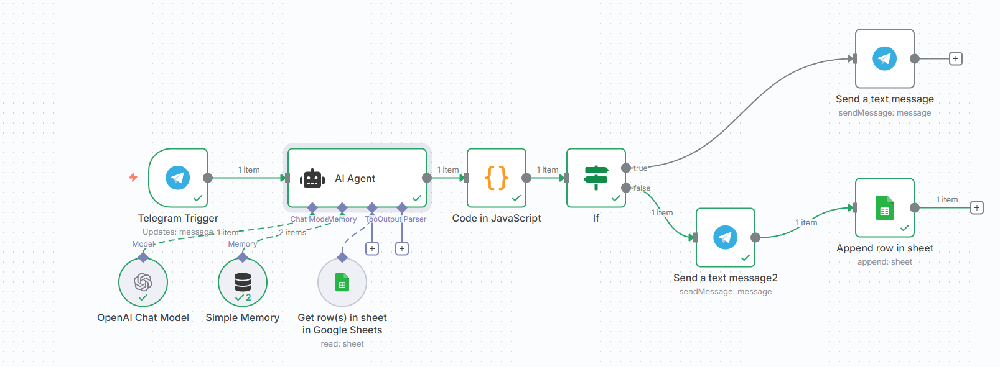
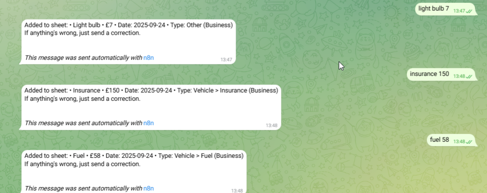
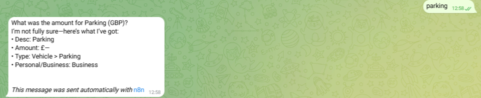
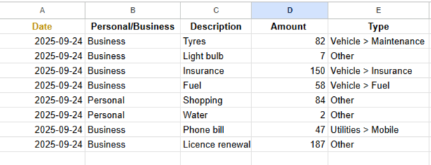
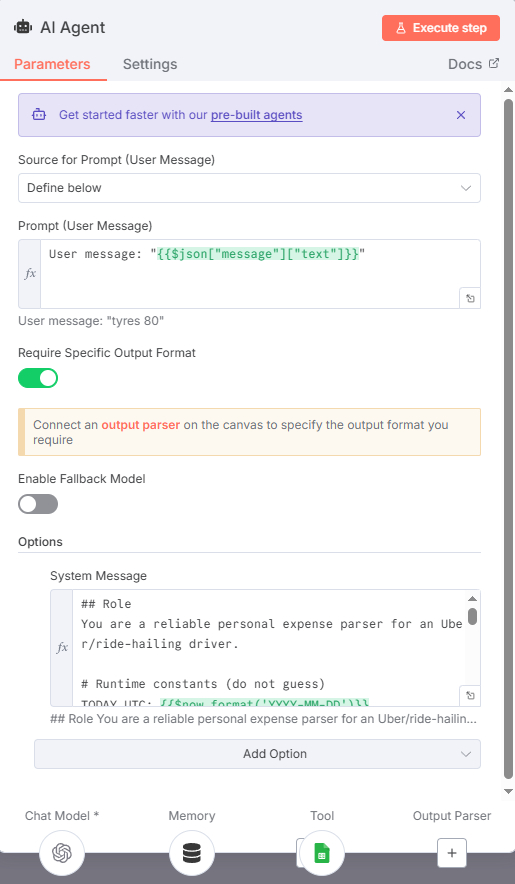
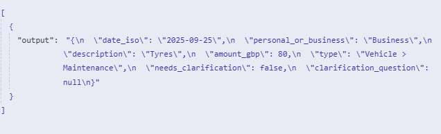
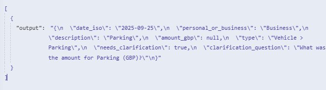

# Driver Expenses Bot

A lightweight **chat-to-spreadsheet assistant** for self-employed drivers (e.g., Uber, Bolt, etc.).

💬 Send a Telegram message like `tyres 80`, and the bot:

1. Parses the message with an AI Agent (OpenAI)
2. Asks a clarifying question if needed
3. Appends the data to Google Sheets
4. Sends you a confirmation

---

## 🧠 Architecture

**Flow Overview**:

**Telegram** → `n8n Trigger` → **AI Agent** (OpenAI) → `Code Node` (validate/normalize)  
→ IF `needs_clarification?`  
├─ Yes → Telegram (ask)  
└─ No → Google Sheets (append) → Telegram (confirm)


👉 See [`docs/architecture.md`](docs/architecture.md) for full **PlantUML diagrams** and **data model**.

---

## 🧰 Stack

- **n8n** (self-hosted) – workflow automation (Telegram → AI → Sheets)
- **Telegram Bot API** – user interface
- **OpenAI API** – natural language parsing
- **Google Sheets API** – data storage
- **Google Cloud VM / VPS** – hosting environment
- **PlantUML** – system architecture diagrams

---

## 📁 What’s in this repo

```text
driver-expenses-bot/
├── README.md                          # main documentation
├── TESTING.md                         # detailed testing guide
├── CHANGELOG.md                       # version history
├── CONTRIBUTING.md                    # guidelines for contributors
├── SECURITY.md                        # security policy
├── LICENSE                            # MIT license
├── package.json                       # dependencies & scripts
├── package-lock.json                  # locked dependency versions
├── .gitignore                         # ignored files
├── .github/                           # GitHub Actions workflows
│   └── workflows/
│       └── ci.yml
├── env/
│   └── .env.example                   # environment variable template
├── prompts/
│   ├── ai-agent-system.md             # system prompt for OpenAI
│   └── expense.schema.json            # expected output format
├── workflow/
│   └── driver-expenses-bot.json       # exported n8n workflow
├── tests/
│   ├── validate-fixtures.mjs          # AJV validator
│   └── fixtures/
│       ├── tyres_80.in.txt
│       ├── tyres_80.out.json
│       ├── parking_missing_amount.in.txt
│       └── parking_missing_amount.out.json
├── docs/
│   ├── architecture.md                # full architecture description
│   ├── code-node-snippet.js           # custom JS code for n8n Code node
│   ├── sample-sheet.csv               # structure of the Google Sheet
│   ├── diagrams/                      # PlantUML sources
│   │   ├── architecture.puml
│   │   ├── context_map.puml
│   │   └── sequence_happy_path.puml
│   └── screenshots/                   # PNG/JPG screenshots of the flow
│       ├── ai_agent_output.jpg
│       ├── ai_agent_prompt.jpg
│       ├── json_output_clarification.jpg
│       ├── google_sheets_data.png
│       ├── telegram_interaction.png
│       ├── n8n_workflow.jpg
│       └── telegram_clarification.jpg
├── tools/
│   └── plantuml.jar                   # optional, for UML rendering

```

📌 **Note**: Dependencies (`node_modules/`) are installed locally with `npm install` and excluded from the repo by `.gitignore.`

---

## ⚙️ Prerequisites

- Git, Docker (or VPS with n8n)
- Telegram Bot token (via [@BotFather](https://t.me/BotFather))
- OpenAI API key
- Google Sheets API + service account with Editor access

---

## 🚀 Quick Setup

1. Copy `.env.example` to `.env` and fill in your credentials.
2. In **n8n**:
   - Add credentials for Telegram, OpenAI, and Google Sheets.
   - Import `workflow/driver-expenses-bot.json`.
   - Paste JS from `docs/code-node-snippet.js` into the Code node.
3. Set up your Google Sheet with the following headers (row 1):

Date | Personal/Business | Description | Amount | Type


✅ Or import `docs/sample-sheet.csv` as a template.

4. Start the workflow and test via Telegram.

---

## 🧪 Troubleshooting

| Error | Fix |
|------|-----|
| `No columns found` | Ensure Sheet has header row + service account has Editor access |
| `IF node type mismatch` | Enable “Convert types where required” |
| Chat ID missing | Use `{{$json._chat_id}}` or `{{$node["Telegram Trigger"].json.message.chat.id}}` |

---

## ❓ Clarifying Questions

If the user message is incomplete (e.g., missing amount), the bot asks one follow-up question like:

> “What was the amount (GBP)?”

When the user replies (e.g., `50`), the system completes the previous entry.


---

## 🔐 Ethics & Security

- ✅ No secrets in repo – all sensitive data via `.env` or n8n credentials
- ✅ Minimum permissions for Google service accounts
- ⚠️ Remind users that their data is being stored (ethical design)
- 🛑 Currently designed for **personal** use only – not multi-user

---

## 📸 Screenshots

Click to view key parts of the automation:

  
*The full n8n pipeline: Telegram Trigger → OpenAI (AI Agent) → Code (normalize/validate) → IF (needs clarification?) → Google Sheets (append) → Telegram (confirm).*

  
*“Happy path” example — user sends `tyres 80`, the bot parses it and confirms the logged expense.*

  
*When a message is incomplete (e.g., `parking` with no amount), the bot asks a single follow-up: “What was the amount (GBP)?”*

  
*Destination sheet with the required headers and appended rows (date, P/B, description, amount, type).*

  
*The system prompt shown in the AI node — defines the extraction rules and allowed categories.*

  
*Structured JSON returned by the AI Agent (e.g., `date_iso`, `personal_or_business`, `amount_gbp`, `type`, etc.).*

  
*Example output where `needs_clarification` is `true` and `clarification_question` guides the follow-up.*

---

## 📦 Local Testing Instructions

Want to verify the schema output yourself?

---

### 🛠️ Prerequisites:

- **Node.js** v20+ (nvm recommended: nvm use)

- **Git**

---

### 🧪 Run the test fixtures

These test cases check that the AI output (`JSON`) matches the expected schema.

#### 1. Clone the repo
```bash
git clone https://github.com/NicSterian/driver-expenses-bot.git
cd driver-expenses-bot 
```

#### 2. Install dependencies
```bash
npm install 
```

#### 3. Run tests
```bash
npm test 
```
 

✅ Alternatively, run manually:
```markdown
`node tests/validate-fixtures.mjs`
```


You should see output like:
```bash   
✅ tyres 80 matches schema
✅ parking (missing amount) matches schema
```

If any test fails, it will show detailed validation errors.


---

## 🛠️ Configuration & Deployment Guide

This section explains **how to set up, deploy, and test** the bot end-to-end — whether you're running locally or on a cloud VPS.

---

### 🌐 1. n8n Workflow Import

You can find the exported n8n workflow in:

📂 [`workflow/driver-expenses-bot.json`](workflow/driver-expenses-bot.json)

To use it:

1. Open your **n8n Editor UI**
2. Click the **hamburger menu (☰)** → **Import Workflow**
3. Upload the exported JSON file
4. Paste the JS code from [`docs/code-node-snippet.js`](docs/code-node-snippet.js) into the **Code** node

✅ Make sure your **Telegram**, **OpenAI**, and **Google Sheets** credentials are added under **Credentials** in n8n.

---

### 🤖 2. Telegram Bot Setup

You need a Telegram bot to interact with the automation.

**Steps:**

1. Open Telegram and talk to [@BotFather](https://t.me/BotFather)
2. Create a new bot and copy the **API token**
3. In **n8n**, add new Telegram credentials using that token
4. Start a chat with your bot on Telegram so it can receive messages

---

### 🔑 3. OpenAI API Setup

Used for parsing expense messages like `fuel 40` or `parking`.

**Steps:**

1. Go to [platform.openai.com](https://platform.openai.com/account/api-keys)
2. Create an API key
3. Add this key as a credential in **n8n**
4. It will be used in the **OpenAI** node inside the workflow

---

### 📊 4. Google Sheets API Setup

The expenses are logged to a Google Sheet.

**Steps:**

1. Create a Google Sheet with this header row (Row 1):

   ```text
   Date (ISO) | Personal/Business | Description | Amount (GBP) | Type

2. Go to [Google Cloud Console](https://console.cloud.google.com/)

3. Create a **Service Account** with **Editor** access to Google Sheets

4. Share the spreadsheet with the service account’s email

5. Upload your **service account JSON key** to n8n and create new **Google Sheets credentials**

✅ Or import [`docs/sample-sheet.csv`](docs/sample-sheet.csv) as a template.

---

### 🖥️ 5. Deployment (Docker + Caddy + VPS)

This project was deployed on a **Google Cloud VM (Ubuntu)** using:

**Docker Compose** – to run n8n

**Caddy** – as a reverse proxy with auto HTTPS

[sslip.io](https://sslip.io/) – to create a hostname based on the IP

🔗 Example URL:
[https://35-214-93-205.sslip.io/workflow/zptVWHkZ1Orx69w2](https://35-214-93-205.sslip.io/workflow/zptVWHkZ1Orx69w2)

💡 **Deployment Alternatives**

| Option      | Description                                                                 |
|-------------|-----------------------------------------------------------------------------|
| **Localhost** | Run with Docker Compose on your own machine. Access via `http://localhost:5678` |
| **Other VPS** | Works with providers like DigitalOcean, Hetzner, or any Docker-compatible host |
| **n8n.cloud** | Use the official hosted version of n8n — no Docker or server needed         |

---


## 🧪 Testing


For validation and end-to-end testing instructions, see the dedicated guide:


📄 [Testing Guide](TESTING.md)


---

🧪 **Local Testing**

If you want to test locally (without full deployment):

1. Run `n8n` using Docker:
   ```bash
   docker run -it --rm -p 5678:5678 n8nio/n8n

2. Use **ngrok** to expose your port to Telegram:
   ```bash
   ngrok http 5678

3. Update the **Webhook URL** in Telegram to use the `ngrok` HTTPS address

⚠️ **Note**: Free `ngrok` sessions reset every time you restart it, which means your Telegram Webhook URL will change.
If you want a **persistent URL**, you’ll need a paid `ngrok` plan or an alternative tunneling tool.

---

## 📄 License

MIT License

---

## 🎓 Academic Note

This project was developed as part of the **Professional Development module** at **Elizabeth School of London**, in partnership with **Newcastle College Group** (NCG).

- [🔗 GitHub Repo](https://github.com/NicSterian/driver-expenses-bot)
- [🔗 LinkedIn Profile](https://www.linkedin.com/in/nicolae-sterian)
- 📎 CV available on LinkedIn or on request

---
