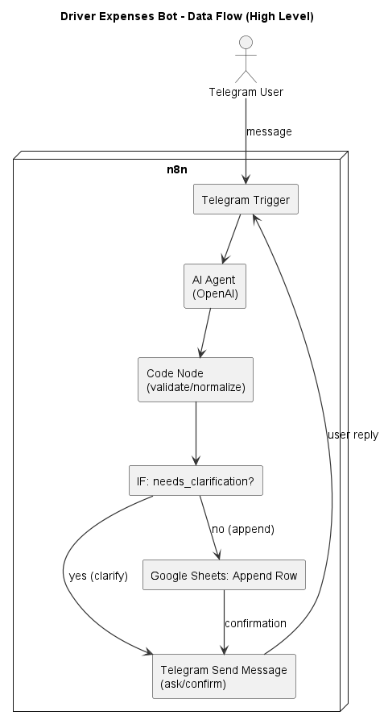
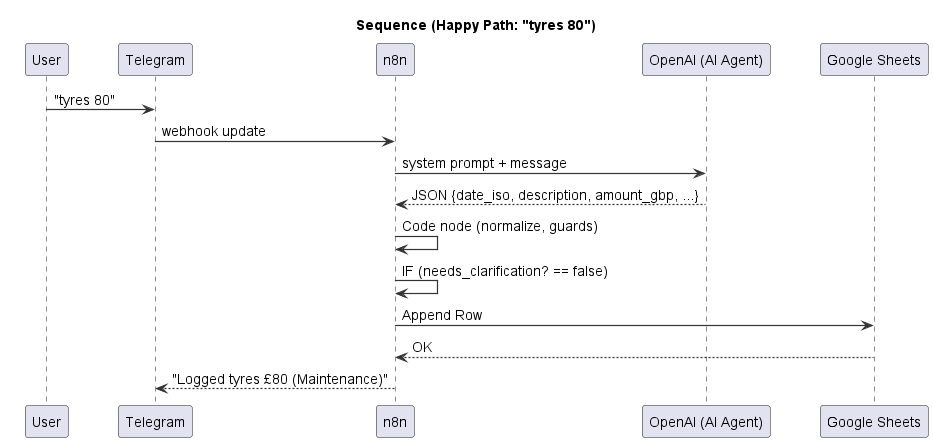
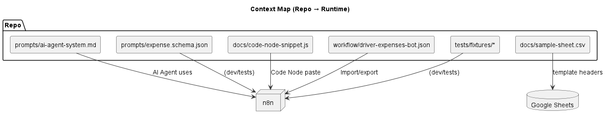

# Architecture

## Data Flow (High Level)

## Sequence (Happy Path: "tyres 80")

## Context Map

## Data Model (Sheet headers)
- **Date (ISO)** – YYYY-MM-DD (UTC calendar date)
- **Personal/Business** – `"Personal"` or `"Business"`
- **Description** – short human text
- **Amount (GBP)** – number (2dp)
- **Type** – one of the allowed categories

> Source `.puml` files are in `docs/diagrams/` if you want to edit and re-export.
